## 🟥 Applying Filter

### 📷 Python Code (8_blur_avg_kernel.py)

```python
import cv2
import numpy as np

img = cv2.imread('../img/city.jpg')
'''
#5x5 평균 필터 커널 생성    ---①
kernel = np.array([[0.04, 0.04, 0.04, 0.04, 0.04],
                   [0.04, 0.04, 0.04, 0.04, 0.04],
                   [0.04, 0.04, 0.04, 0.04, 0.04],
                   [0.04, 0.04, 0.04, 0.04, 0.04],
                   [0.04, 0.04, 0.04, 0.04, 0.04]])
'''
# 5x5 평균 필터 커널 생성  ---②
kernel = np.ones((5,5))/5**2
# 필터 적용             ---③
blured = cv2.filter2D(img, -1, kernel)

# 결과 출력
cv2.imshow('origin', img)
cv2.imshow('avrg blur', blured) 
cv2.waitKey()
cv2.destroyAllWindows()

```

### 📷 **Result Screenshot:**

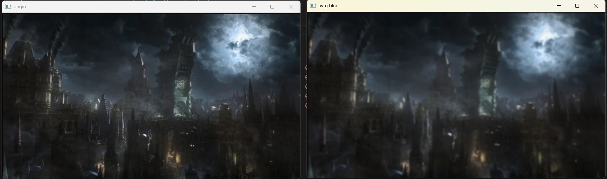
<br>

---

<br>

### 📷 Python Code (9_blur_avg_api.py)

```python
import cv2
import numpy as np

file_name = '../img/jinx.jpg'
img = cv2.imread(file_name)

# blur() 함수로 블러링  ---①
blur1 = cv2.blur(img, (10,10))
# boxFilter() 함수로 블러링 적용 ---②
blur2 = cv2.boxFilter(img, -1, (10,10))

# 결과 출력
merged = np.hstack( (img, blur1, blur2))
cv2.imshow('blur', merged)
cv2.waitKey(0)
cv2.destroyAllWindows()

```

### 📷 **Result Screenshot:**

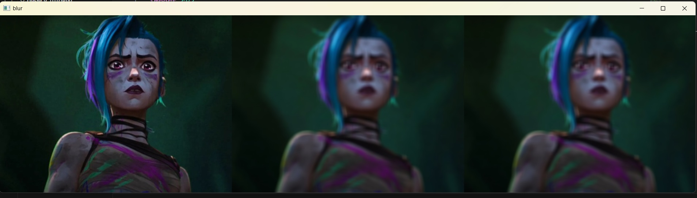
<br>

---

<br>

### 📷 Python Code (10_blur_gaussian.py)

```python
import cv2
import numpy as np

img = cv2.imread('../img/gaussian_noise.jpg')

# 가우시안 커널을 직접 생성해서 블러링  ---①
k1 = np.array([[1, 2, 1],
                   [2, 4, 2],
                   [1, 2, 1]]) *(1/16)
blur1 = cv2.filter2D(img, -1, k1)

# 가우시안 커널을 API로 얻어서 블러링 ---②
k2 = cv2.getGaussianKernel(3, 0)
blur2 = cv2.filter2D(img, -1, k2*k2.T)

# 가우시안 블러 API로 블러링 ---③
blur3 = cv2.GaussianBlur(img, (3, 3), 0)

# 결과 출력
print('k1:', k1)
print('k2:', k2*k2.T)
merged = np.hstack((img, blur1, blur2, blur3))
cv2.imshow('gaussian blur', merged)
cv2.waitKey(0)
cv2.destroyAllWindows()

```

### 📷 **Result Screenshot:**

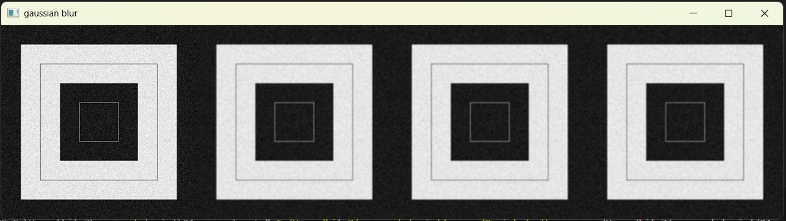
<br>

---

<br>

### 📷 Python Code (11_blur_median.py)

```python
import cv2
import numpy as np

img = cv2.imread("../img/salt_pepper_noise.jpg")

# 미디언 블러 적용 --- ①
blur = cv2.medianBlur(img, 5)

# 결과 출력 
merged = np.hstack((img,blur))
cv2.imshow('media', merged)
cv2.waitKey(0)
cv2.destroyAllWindows()

```

### 📷 **Result Screenshot:**

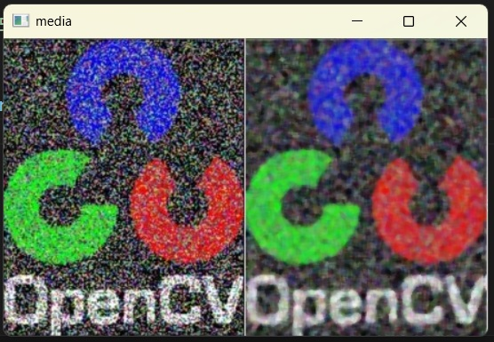
<br>

---

<br>

### 📷 Python Code (12_blur_bilateral.py)

```python
import cv2
import numpy as np

img = cv2.imread("../img/gaussian_noise.jpg")

# 가우시안 필터 적용 ---①
blur1 = cv2.GaussianBlur(img, (5,5), 0)

# 바이레터럴 필터 적용 ---②
blur2 = cv2.bilateralFilter(img, 5, 75, 75)

# 결과 출력
merged = np.hstack((img, blur1, blur2))
cv2.imshow('bilateral', merged)
cv2.waitKey(0)
cv2.destroyAllWindows()

```

### 📷 **Result Screenshot:**

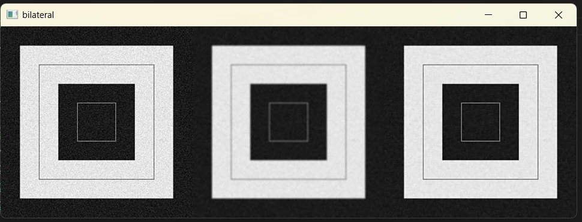
<br>

---

<br>

### 📷 Python Code (13_edge_differential.py)

```python
import cv2
import numpy as np

img = cv2.imread("../img/sudoku.jpg")

#미분 커널 생성 ---①
gx_kernel = np.array([[ -1, 1]])
gy_kernel = np.array([[ -1],[ 1]])

# 필터 적용 ---②
edge_gx = cv2.filter2D(img, -1, gx_kernel)
edge_gy = cv2.filter2D(img, -1, gy_kernel)
# 결과 출력
merged = np.hstack((img, edge_gx, edge_gy))
cv2.imshow('edge', merged)
cv2.waitKey(0)
cv2.destroyAllWindows()

```

### 📷 **Result Screenshot:**

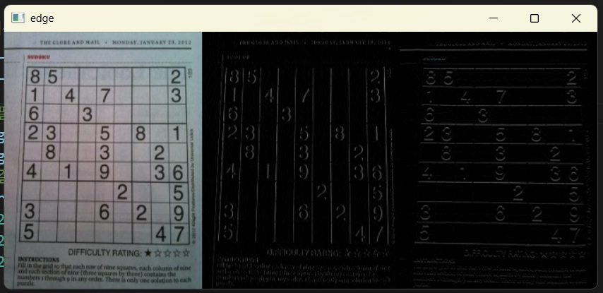
<br>

---

<br>

### 📷 Python Code (14_edge_canny.py)

```python
import cv2, time
import numpy as np

img = cv2.imread("../img/sudoku.jpg")

# 케니 엣지 적용 
edges = cv2.Canny(img,100,200)

# 결과 출력
cv2.imshow('Original', img)
cv2.imshow('Canny', edges)
cv2.waitKey(0)
cv2.destroyAllWindows()

```

### 📷 **Result Screenshot:**

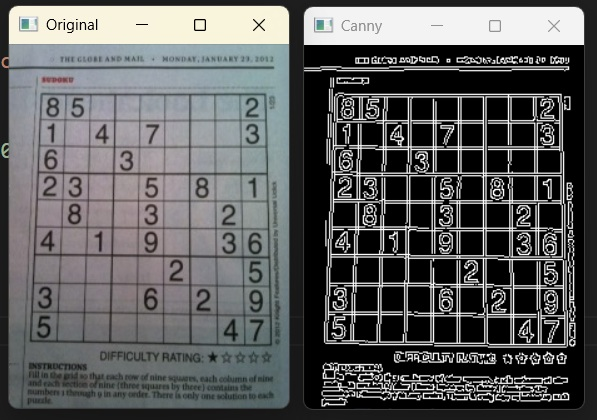
<br>

---

<br>

### 📷 Python Code (15_practice02.py)

```python
# 자동차 번호판 추출해내기 수정판
# 필터를 적용해서 이미지 노이즈 제거 및 경계 검출

import cv2
import numpy as np
from matplotlib import pyplot as plt
import os

# 추출된 번호판 이미지 로드
def load_extracted_plate(plate_name):
    plate_path = f'../img/{plate_name}.jpg'

    if os.path.exists(plate_path):
        plate_img = cv2.imread(plate_path)
        print(f"번호판 이미지 로드 완료: {plate_img.shape}")
        return plate_img

    else:
        print(f"파일을 찾을 수 없습니다: {plate_path}")
        return None
        
# 번호판을 그레이스케일로 변환
def convert_to_grayscale(plate_img):
    # BGR을 그레이스케일로 변환
    gray_plate = cv2.cvtColor(plate_img, cv2.COLOR_BGR2GRAY)

    # 결과 비교 시각화
    plt.figure(figsize=(12, 4))
    plt.subplot(1, 2, 1)
    plt.imshow(cv2.cvtColor(plate_img, cv2.COLOR_BGR2RGB))
    plt.title('Original Extracted Plate')
    plt.axis('off')
    plt.subplot(1, 2, 2)
    plt.imshow(gray_plate, cmap='gray')
    plt.title('Grayscale Plate')
    plt.axis('off')
    plt.tight_layout()
    plt.show()

    return gray_plate

# 번호판의 글자 대비 최대화
def maximize_contrast(gray_plate):
    # 모폴로지 연산용 구조화 요소 (번호판용으로 작게 설정)
    kernel = cv2.getStructuringElement(cv2.MORPH_RECT, (2, 2))  # 3x3 → 2x2로 축소

    # Top Hat: 밝은 세부사항 (흰 배경) 강조
    tophat = cv2.morphologyEx(gray_plate, cv2.MORPH_TOPHAT, kernel)

    # Black Hat: 어두운 세부사항 (검은 글자) 강조  
    blackhat = cv2.morphologyEx(gray_plate, cv2.MORPH_BLACKHAT, kernel)

    # 대비 향상 적용
    enhanced = cv2.add(gray_plate, tophat)
    enhanced = cv2.subtract(enhanced, blackhat)

    # 추가: 히스토그램 균등화로 대비 더욱 향상
    enhanced = cv2.equalizeHist(enhanced)

    # 결과 비교
    plt.figure(figsize=(15, 4))
    plt.subplot(1, 4, 1)
    plt.imshow(gray_plate, cmap='gray')
    plt.title('Original Gray')
    plt.axis('off')
    plt.subplot(1, 4, 2)
    plt.imshow(tophat, cmap='gray')
    plt.title('Top Hat')
    plt.axis('off')
    plt.subplot(1, 4, 3)
    plt.imshow(blackhat, cmap='gray')
    plt.title('Black Hat')
    plt.axis('off')
    plt.subplot(1, 4, 4)
    plt.imshow(enhanced, cmap='gray')
    plt.title('Enhanced Contrast')
    plt.axis('off')
    plt.tight_layout()
    plt.show()

    return enhanced

# 고급 대비 향상 기법
def advanced_contrast_enhancement(gray_plate):
     # CLAHE (적응형 히스토그램 균등화)
    clahe = cv2.createCLAHE(clipLimit=3.0, tileGridSize=(2,1))  # 번호판용 설정
    clahe_result = clahe.apply(gray_plate)

    # 감마 보정
    gamma = 1.2  # 밝기 조정
    gamma_corrected = np.array(255 * (gray_plate / 255) ** gamma, dtype='uint8')

    return clahe_result, gamma_corrected

# 번호판 전용 적응형 임계처리
def adaptive_threshold_plate(enhanced_plate):
    # 가벼운 블러링 (노이즈 제거, 글자는 보존)
    blurred = cv2.GaussianBlur(enhanced_plate, (3, 3), 0)  # 5x5 → 3x3로 축소

    # 번호판 최적화 적응형 임계처리
    thresh_adaptive = cv2.adaptiveThreshold(
        blurred,
        maxValue=255,
        adaptiveMethod=cv2.ADAPTIVE_THRESH_GAUSSIAN_C,
        thresholdType=cv2.THRESH_BINARY,  # BINARY_INV 대신 BINARY 사용
        blockSize=11,  # 19 → 11로 축소 (번호판 크기에 맞춤)
        C=2           # 9 → 2로 축소 (세밀한 조정)
    )

    # Otsu 임계처리와 비교
    _, thresh_otsu = cv2.threshold(blurred, 0, 255, 
                                   cv2.THRESH_BINARY + cv2.THRESH_OTSU)

    # 결과 비교
    plt.figure(figsize=(16, 4))
    plt.subplot(1, 4, 1)
    plt.imshow(enhanced_plate, cmap='gray')
    plt.title('Enhanced Plate')
    plt.axis('off')
    plt.subplot(1, 4, 2)
    plt.imshow(blurred, cmap='gray')
    plt.title('Blurred')
    plt.axis('off')
    plt.subplot(1, 4, 3)
    plt.imshow(thresh_adaptive, cmap='gray')
    plt.title('Adaptive Threshold')
    plt.axis('off')
    plt.subplot(1, 4, 4)
    plt.imshow(thresh_otsu, cmap='gray')
    plt.title('Otsu Threshold')
    plt.axis('off')
    plt.tight_layout()
    plt.show()

    return thresh_adaptive, thresh_otsu

# 번호판에서 윤곽선 검출
def find_contours_in_plate(thresh_plate):
    # 윤곽선 검출
    contours, hierarchy = cv2.findContours(
        thresh_plate,                   # 이진화된 번호판 이미지
        mode=cv2.RETR_EXTERNAL,         # 가장 바깥쪽 윤곽선만 검출
        method=cv2.CHAIN_APPROX_SIMPLE  # 윤곽선 단순화
    )

    # 결과 시각화용 이미지 생성 (컬러)
    height, width = thresh_plate.shape
    contour_image = cv2.cvtColor(thresh_plate, cv2.COLOR_GRAY2BGR)

    # 모든 윤곽선을 다른 색으로 그리기
    colors = [(255, 0, 0), (0, 255, 0), (0, 0, 255), (255, 255, 0), 
              (255, 0, 255), (0, 255, 255), (128, 0, 128), (255, 165, 0)]

    for i, contour in enumerate(contours):
        color = colors[i % len(colors)]  # 색상 순환
        cv2.drawContours(contour_image, [contour], -1, color, 2)

        # 윤곽선 번호 표시
        M = cv2.moments(contour)
        if M["m00"] != 0:
            cx = int(M["m10"] / M["m00"])
            cy = int(M["m01"] / M["m00"])
            cv2.putText(contour_image, str(i+1), (cx-5, cy+5), 
                       cv2.FONT_HERSHEY_SIMPLEX, 0.4, (255, 255, 255), 1)

    # 결과 시각화
    plt.figure(figsize=(15, 5))
    plt.subplot(1, 3, 1)
    plt.imshow(thresh_plate, cmap='gray')
    plt.title('Binary Plate')
    plt.axis('off')
    plt.subplot(1, 3, 2)
    plt.imshow(contour_image)
    plt.title(f'Contours Detected: {len(contours)}')
    plt.axis('off')

    # 윤곽선 정보 표시
    plt.subplot(1, 3, 3)
    contour_info = np.zeros((height, width, 3), dtype=np.uint8)

    for i, contour in enumerate(contours):
        area = cv2.contourArea(contour)
        x, y, w, h = cv2.boundingRect(contour)

        # 경계 사각형 그리기
        cv2.rectangle(contour_info, (x, y), (x+w, y+h), colors[i % len(colors)], 1)

        # 면적 정보 표시 (작은 글씨로)
        cv2.putText(contour_info, f'A:{int(area)}', (x, y-2), 
                   cv2.FONT_HERSHEY_SIMPLEX, 0.25, (255, 255, 255), 1)

    plt.imshow(contour_info)
    plt.title('Bounding Rectangles')
    plt.axis('off')
    plt.tight_layout()
    plt.show()

    # 윤곽선 정보 출력
    print("=== 윤곽선 검출 결과 ===")
    print(f"총 윤곽선 개수: {len(contours)}")

    for i, contour in enumerate(contours):
        area = cv2.contourArea(contour)
        x, y, w, h = cv2.boundingRect(contour)
        aspect_ratio = w / h if h > 0 else 0
        print(f"윤곽선 {i+1}: 면적={area:.0f}, \
              크기=({w}×{h}), 비율={aspect_ratio:.2f}")

    return contours, contour_image

# 다양한 윤곽선 검출 모드 비교
def compare_contour_modes(thresh_plate):
    # 여러 모드로 윤곽선 검출
    modes = [
        (cv2.RETR_EXTERNAL, "EXTERNAL"),
        (cv2.RETR_LIST, "LIST"), 
        (cv2.RETR_TREE, "TREE")
    ]

    plt.figure(figsize=(15, 5))

    for i, (mode, mode_name) in enumerate(modes):
        contours, _ = cv2.findContours(thresh_plate, mode, cv2.CHAIN_APPROX_SIMPLE)
        result_img = cv2.cvtColor(thresh_plate, cv2.COLOR_GRAY2BGR)
        cv2.drawContours(result_img, contours, -1, (0, 255, 0), 1)

        plt.subplot(1, 3, i+1)
        plt.imshow(result_img)
        plt.title(f'{mode_name}: {len(contours)} contours')
        plt.axis('off')

    plt.tight_layout()
    plt.show()

# 윤곽선 통계 분석
def analyze_contour_statistics(contours):
    if len(contours) == 0:
        print("검출된 윤곽선이 없습니다.")
        return

    areas = [cv2.contourArea(contour) for contour in contours]
    perimeters = [cv2.arcLength(contour, True) for contour in contours]

    print("=== 윤곽선 통계 ===")
    print(f"개수: {len(contours)}")
    print(f"면적 - 평균: {np.mean(areas):.1f}, \
          최소: {min(areas):.1f}, 최대: {max(areas):.1f}")
    print(f"둘레 - 평균: {np.mean(perimeters):.1f}, \
          최소: {min(perimeters):.1f}, 최대: {max(perimeters):.1f}")

    # 면적별 분포
    area_ranges = [(0, 50), (50, 200), (200, 500), (500, 1000), (1000, float('inf'))]

    for min_area, max_area in area_ranges:
        count = sum(1 for area in areas if min_area <= area < max_area)
        if count > 0:
            range_str = f"{min_area}-{max_area if max_area != float('inf') else '∞'}"
            print(f"면적 {range_str}: {count}개")

# 다음 단계(글자 분석)를 위한 기본 정보 준비
def prepare_for_next_step(contours, thresh_plate):
    print("=== 다음 단계 준비 ===")

    # 윤곽선이 충분히 검출되었는지 확인
    if len(contours) < 5:
        print("윤곽선이 적게 검출되었습니다. 전처리 단계를 재검토하세요.")

    elif len(contours) > 20:
        print("윤곽선이 너무 많이 검출되었습니다. 노이즈 제거가 필요할 수 있습니다.")

    else:
        print("적절한 수의 윤곽선이 검출되었습니다.")

    # 잠재적 글자 후보 개수 추정
    potential_chars = 0

    for contour in contours:
        area = cv2.contourArea(contour)

        if 30 < area < 2000:  # 글자 크기 범위 추정
            potential_chars += 1

    print(f"잠재적 글자 후보: {potential_chars}개")

    return potential_chars

# 처리된 번호판 이미지들을 체계적으로 저장
def save_processed_results(plate_name, gray_plate, 
                           enhanced_plate, thresh_plate, 
                           contour_result):
    # 저장 폴더 생성
    save_dir = '../result_screenshot/plates_number'

    if not os.path.exists(save_dir):
        os.makedirs(save_dir) 

    # 각 단계별 결과 저장
    cv2.imwrite(f'{save_dir}/{plate_name}_1_gray.jpg', gray_plate)
    cv2.imwrite(f'{save_dir}/{plate_name}_2_enhanced.jpg', enhanced_plate)  
    cv2.imwrite(f'{save_dir}/{plate_name}_3_threshold.jpg', thresh_plate)
    cv2.imwrite(f'{save_dir}/{plate_name}_4_contours.jpg', contour_result)

    print(f"처리 결과 저장 완료: {save_dir}/{plate_name}_*.jpg")

# 전체 처리 파이프라인
# 추출된 번호판의 완전한 처리 파이프라인
def process_extracted_plate(plate_name):
    print(f"=== {plate_name} 처리 시작 ===")

    # 이미지 로드
    plate_img = load_extracted_plate(plate_name)

    if plate_img is None:
        return None

    # 그레이스케일 변환
    gray_plate = convert_to_grayscale(plate_img)

    # 대비 최대화
    enhanced_plate = maximize_contrast(gray_plate)

    # 적응형 임계처리
    thresh_plate, _ = adaptive_threshold_plate(enhanced_plate)

    # 윤곽선 검출
    contours, contour_result = find_contours_in_plate(thresh_plate)

    # 결과 저장
    save_processed_results(plate_name, gray_plate, enhanced_plate, thresh_plate, contour_result)

    # 처리 결과 요약
    potential_chars = prepare_for_next_step(contours, thresh_plate)
    print(f"처리 완료 - 검출된 윤곽선: {len(contours)}개, 잠재적 글자: {potential_chars}개")

    return {
        'original': plate_img,
        'gray': gray_plate, 
        'enhanced': enhanced_plate,
        'threshold': thresh_plate,
        'contours': len(contours),
        'potential_chars': potential_chars,
        'contour_result': contour_result
    }

# 배치 처리
# img 폴더의 모든 번호판 처리
def batch_process_plates():
    plate_dir = '../img'

    if not os.path.exists(plate_dir):
        print(f"폴더를 찾을 수 없습니다: {plate_dir}")
        return {}

    plate_files = [f for f in os.listdir(plate_dir) if f.endswith('.jpg')]

    if len(plate_files) == 0:
        print("처리할 번호판 이미지가 없습니다.")
        return {}

    results = {}

    for plate_file in plate_files:
        plate_name = plate_file.replace('.jpg', '')
        result = process_extracted_plate(plate_name)

        if result:
            results[plate_name] = result

    print(f"\n=== 전체 처리 완료: {len(results)}개 번호판 ===")

    return results


# 터미널을 통해 차량 번호판 갯수 입력
car_num = int(input("번호판 스캔하려는 차량의 갯수를 입력하시오: "))
for i in range(1, car_num+1):
    img = cv2.imread(f"../img/car_{i}.jpg")
    win_name = f"scanning_{i}"
    rows, cols = img.shape[:2]
    draw = img.copy()
    pts_cnt = 0
    pts = np.zeros((4,2), dtype=np.float32)

    # 마우스 이벤트 callback 함수 구현
    def onMouse(event, x, y, flags, param):
        # 마우스로 찍은 좌표 갯수 저장
        global  pts_cnt
        if event == cv2.EVENT_LBUTTONDOWN:
            # 좌표에 초록색 동그라미 표시
            cv2.circle(draw, (x,y), 10, (0,255,0), -1)
            cv2.imshow(win_name, draw)

            # 마우스 좌표 저장
            pts[pts_cnt] = [x,y]
            pts_cnt+=1

            # 좌표가 4개 수집되면
            if pts_cnt == 4:
                # 좌표 4개 중 상하좌우 찾기
                sm = pts.sum(axis=1)                # 4쌍의 좌표 각각 x+y 계산
                diff = np.diff(pts, axis = 1)       # 4쌍의 좌표 각각 x-y 계산

                topLeft = pts[np.argmin(sm)]        # x+y가 가장 값이 좌상단 좌표
                bottomRight = pts[np.argmax(sm)]    # x+y가 가장 큰 값이 우하단 좌표
                topRight = pts[np.argmin(diff)]     # x-y가 가장 작은 것이 우상단 좌표
                bottomLeft = pts[np.argmax(diff)]   # x-y가 가장 큰 값이 좌하단 좌표

                # 변환 전 4개 좌표 
                pts1 = np.float32([topLeft, topRight, bottomRight , bottomLeft])

                # 변환 후 영상에 사용할 서류의 폭과 높이 계산
                w1 = abs(bottomRight[0] - bottomLeft[0])    # 상단 좌우 좌표간의 거리
                w2 = abs(topRight[0] - topLeft[0])          # 하당 좌우 좌표간의 거리
                h1 = abs(topRight[1] - bottomRight[1])      # 우측 상하 좌표간의 거리
                h2 = abs(topLeft[1] - bottomLeft[1])        # 좌측 상하 좌표간의 거리
                width = max([w1, w2])                       # 두 좌우 거리간의 최대값이 서류의 폭
                height = max([h1, h2])                      # 두 상하 거리간의 최대값이 서류의 높이
            
                # 변환 후 4개 좌표
                pts2 = np.float32([[0,0], [width-1,0], 
                                   [width-1,height-1], [0,height-1]])

                # 변환 행렬 계산 
                mtrx = cv2.getPerspectiveTransform(pts1, pts2)
                # 원근 변환 적용
                result = cv2.warpPerspective(img, mtrx, 
                                             (int(width), int(height)))  # 주의! 해상도 적용 시, int를 지정해줘야 함!
                cv2.imshow('scanned', result)
                cv2.imwrite(f'../img/car_scanned_{i}.jpg', result)

    cv2.imshow(win_name, img)
    # 마우스 callback 함수를 GUI 윈도우에 등록
    cv2.setMouseCallback(win_name, onMouse)
    cv2.waitKey(0)
    # 실 사진 파일 이름 입력
    plate_result = process_extracted_plate(f'car_scanned_{i}')
    cv2.waitKey(0)

cv2.destroyAllWindows()

```

### 📷 **Result Screenshot:**

car_scanned_1.jpg

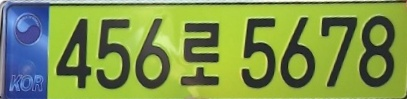
<br>

car_scanned_1_1_gray.jpg

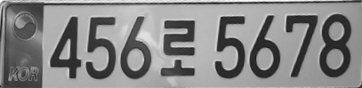
<br>

car_scanned_1_2_enhanced.jpg

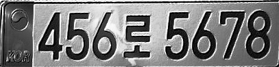
<br>

car_scanned_1_3_threshold.jpg

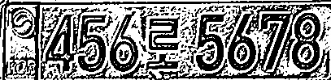
<br>

car_scanned_1_4_contours.jpg


<br>

---

<br>

