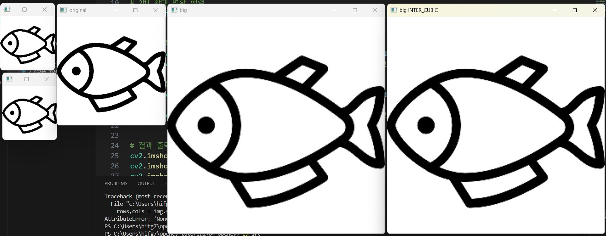
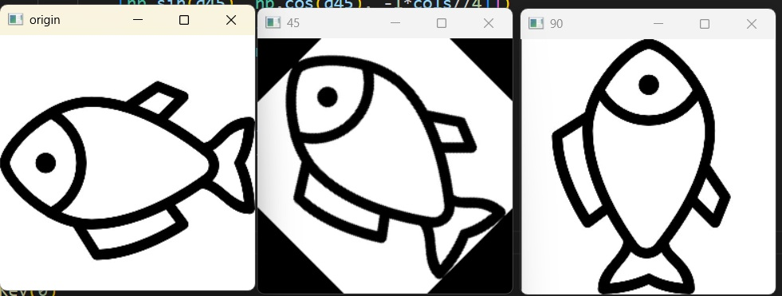
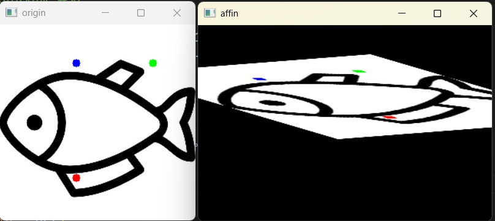
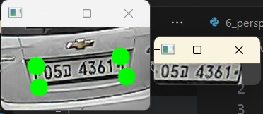

## 🟥 Skewing Image

### 📷 Python Code (1_translate.py)

```python
import cv2
import numpy as np

img = cv2.imread('../img/fish.jpg')
# 영상의 크기
rows, cols = img.shape[0:2]

dx, dy = 100, 50

# 변환 행렬 생성
mtrx = np.float32([[1, 0, dx],
                   [0, 1, dy]])

# 단순 이동
dst = cv2.warpAffine(img, mtrx, (cols+dx, rows+dy))

# 탈락된 외곽 픽셀을 파랑색으로 보정
dst2 = cv2.warpAffine(img, mtrx, (cols+dx, rows+dy), None,
                       cv2.INTER_LINEAR, cv2.BORDER_CONSTANT, (255, 0, 0))

# 탈락된 외곽 픽셀의 원본을 반사시켜서 보정
dst3 = cv2. warpAffine(img, mtrx, (cols+dx, rows+dy), None,
                       cv2.INTER_LINEAR, cv2.BORDER_REFLECT)

cv2.imshow('original', img)
cv2.imshow('trans',dst)
cv2.imshow('BORDER_CONSTATNT', dst2)
cv2.imshow('BORDER_FEFLECT', dst3)
cv2.waitKey(0)
cv2.destroyAllWindows()

```
### 📷 **Result Screenshot:**


<br>

---

<br>

### 📷 Python Code (2_scale_matrix.py)

```python
import cv2
import numpy as np

img = cv2.imread('../img/fish.jpg')
height, width = img.shape[:2]

# 0.5배 축소 변환 행렬
m_small = np.float32([[0.5, 0, 0],
                       [0, 0.5,0]])  
# 2배 확대 변환 행렬
m_big = np.float32([[2, 0, 0],
                     [0, 2, 0]])  

# 보간법 적용 없이 확대 축소
dst1 = cv2.warpAffine(img, m_small, (int(height*0.5), int(width*0.5)))
dst2 = cv2.warpAffine(img, m_big, (int(height*2), int(width*2)))

# 보간법 적용한 확대 축소
dst3 = cv2.warpAffine(img, m_small, (int(height*0.5), int(width*0.5)), \
                        None, cv2.INTER_AREA)
dst4 = cv2.warpAffine(img, m_big, (int(height*2), int(width*2)), \
                        None, cv2.INTER_CUBIC)

# 결과 출력
cv2.imshow("original", img)
cv2.imshow("small", dst1)
cv2.imshow("big", dst2)
cv2.imshow("small INTER_AREA", dst3)
cv2.imshow("big INTER_CUBIC", dst4)
cv2.waitKey(0)
cv2.destroyAllWindows()

```

### 📷 **Result Screenshot:**


<br>

---

<br>

### 📷 Python Code (3_scale_resize.py)

```python
import cv2
import numpy as np

img = cv2.imread('../img/fish.jpg')
height, width = img.shape[:2]

# 크기 지정으로 축소
# 0.5배 크기로 축소
dst1 = cv2.resize(img, (int(width*0.5), int(height*0.5)), interpolation=cv2.INTER_AREA)

# 2배율 지정으로 확대
dst2 = cv2.resize(img, None,  None, 2, 2, cv2.INTER_CUBIC)
# 결과 출력
cv2.imshow("original", img)
cv2.imshow("small", dst1)
cv2.imshow("big", dst2)
cv2.waitKey(0)
cv2.destroyAllWindows()

```

### 📷 **Result Screenshot:**


<br>

---

<br>

### 📷 Python Code (4_rotate_martix.py)

```python
import cv2
import numpy as np

img = cv2.imread('../img/fish.jpg')
rows, cols = img.shape[0:2]

# 라디안 각도 계산 (60진법을 호도법으로 변경)
# 45도 각도
d45 = 45.0 * np.pi / 180
# 90도 각도
d90 = 90.0 * np.pi / 180

# 회전을 위한 변환 행렬 생성
m45 = np.float32( [[ np.cos(d45), -1* np.sin(d45), rows//2],
                    [np.sin(d45), np.cos(d45), -1*cols//4]])
m90 = np.float32( [[ np.cos(d90), -1* np.sin(d90), rows],
                    [np.sin(d90), np.cos(d90), 0]])

# 회전 변환 행렬 적용
r45 = cv2.warpAffine(img,m45,(cols,rows))
r90 = cv2.warpAffine(img,m90,(rows,cols))

# 결과 출력
cv2.imshow("origin", img)
cv2.imshow("45", r45)
cv2.imshow("90", r90)
cv2.waitKey(0)
cv2.destroyAllWindows()

```

### 📷 **Result Screenshot:**


<br>

---

<br>

### 📷 Python Code (5_getAffine.py)

```python
import cv2
import numpy as np
from matplotlib import pyplot as plt

file_name = '../img/fish.jpg'
img = cv2.imread(file_name)
rows, cols = img.shape[:2]

# 변환 전, 후 각 3개의 좌표 생성
pts1 = np.float32([[100, 50], [200, 50], [100, 200]])
pts2 = np.float32([[80, 70], [210, 60], [250, 120]])

# 변환 전 좌표를 이미지에 표시
cv2.circle(img, (100,50), 5, (255,0), -1)
cv2.circle(img, (200,50), 5, (0,255,0), -1)
cv2.circle(img, (100,200), 5, (0,0,255), -1)

# 짝지은 3개의 좌표로 변환 행렬 계산
mtrx = cv2.getAffineTransform(pts1, pts2)
# 어핀 변환 적용
dst = cv2.warpAffine(img, mtrx, (int(cols*1.5), rows))

# 결과 출력
cv2.imshow('origin',img)
cv2.imshow('affin', dst)
cv2.waitKey(0)
cv2.destroyAllWindows()

```

### 📷 **Result Screenshot:**


<br>

---

<br>

### 📷 Python Code (6_perspective_scan.py)

```python
import cv2
import numpy as np

win_name = "scanning"
img = cv2.imread("../img/dragon.jpg")
# img = cv2.imread("../img/paper.jpg")
rows, cols = img.shape[:2]
draw = img.copy()
pts_cnt = 0
pts = np.zeros((4,2), dtype=np.float32)

# 마우스 이벤트 callback 함수 구현
def onMouse(event, x, y, flags, param):
    # 마우스로 찍은 좌표 갯수 저장
    global  pts_cnt
    if event == cv2.EVENT_LBUTTONDOWN:
        # 좌표에 초록색 동그라미 표시
        cv2.circle(draw, (x,y), 10, (0,255,0), -1)
        cv2.imshow(win_name, draw)

        # 마우스 좌표 저장
        pts[pts_cnt] = [x,y]
        pts_cnt+=1

        # 좌표가 4개 수집되면
        if pts_cnt == 4:
            # 좌표 4개 중 상하좌우 찾기
            sm = pts.sum(axis=1)                # 4쌍의 좌표 각각 x+y 계산
            diff = np.diff(pts, axis = 1)       # 4쌍의 좌표 각각 x-y 계산

            topLeft = pts[np.argmin(sm)]        # x+y가 가장 값이 좌상단 좌표
            bottomRight = pts[np.argmax(sm)]    # x+y가 가장 큰 값이 우하단 좌표
            topRight = pts[np.argmin(diff)]     # x-y가 가장 작은 것이 우상단 좌표
            bottomLeft = pts[np.argmax(diff)]   # x-y가 가장 큰 값이 좌하단 좌표

            # 변환 전 4개 좌표 
            pts1 = np.float32([topLeft, topRight, bottomRight , bottomLeft])

            # 변환 후 영상에 사용할 서류의 폭과 높이 계산
            w1 = abs(bottomRight[0] - bottomLeft[0])    # 상단 좌우 좌표간의 거리
            w2 = abs(topRight[0] - topLeft[0])          # 하당 좌우 좌표간의 거리
            h1 = abs(topRight[1] - bottomRight[1])      # 우측 상하 좌표간의 거리
            h2 = abs(topLeft[1] - bottomLeft[1])        # 좌측 상하 좌표간의 거리
            width = max([w1, w2])                       # 두 좌우 거리간의 최대값이 서류의 폭
            height = max([h1, h2])                      # 두 상하 거리간의 최대값이 서류의 높이
            
            # 변환 후 4개 좌표
            pts2 = np.float32([[0,0], [width-1,0], 
                                [width-1,height-1], [0,height-1]])

            # 변환 행렬 계산 
            mtrx = cv2.getPerspectiveTransform(pts1, pts2)
            # 원근 변환 적용
            result = cv2.warpPerspective(img, mtrx, 
                                         (int(width), int(height)))  # 주의! 해상도 적용 시, int를 지정해줘야 함!
            cv2.imshow('scanned', result)

cv2.imshow(win_name, img)
# 마우스 callback 함수를 GUI 윈도우에 등록
cv2.setMouseCallback(win_name, onMouse)
cv2.waitKey(0)
cv2.destroyAllWindows()

```

### 📷 **Result Screenshot:**


<br>

---

<br>

### 📷 Python Code (7_practice01.py)

```python
# 자동차 번호판 추출해내기

import cv2
import numpy as np
import pytesseract

# 문자 인식기 Tesseract
pytesseract.pytesseract.tesseract_cmd = r'C:\Program Files (x86)\Tesseract-OCR\tesseract.exe'

# 터미널을 통해 차량 번호판 갯수 입력
car_num = int(input("번호판 스캔하려는 차량의 갯수를 입력하시오: "))
for i in range(1, car_num+1):
    img = cv2.imread(f"../img/car_{i}.jpg")
    win_name = f"scanning_{i}"
    rows, cols = img.shape[:2]
    draw = img.copy()
    pts_cnt = 0
    pts = np.zeros((4,2), dtype=np.float32)

    # 마우스 이벤트 callback 함수 구현
    def onMouse(event, x, y, flags, param):
        # 마우스로 찍은 좌표 갯수 저장
        global  pts_cnt
        if event == cv2.EVENT_LBUTTONDOWN:
            # 좌표에 초록색 동그라미 표시
            cv2.circle(draw, (x,y), 10, (0,255,0), -1)
            cv2.imshow(win_name, draw)

            # 마우스 좌표 저장
            pts[pts_cnt] = [x,y]
            pts_cnt+=1

            # 좌표가 4개 수집되면
            if pts_cnt == 4:
                # 좌표 4개 중 상하좌우 찾기
                sm = pts.sum(axis=1)                # 4쌍의 좌표 각각 x+y 계산
                diff = np.diff(pts, axis = 1)       # 4쌍의 좌표 각각 x-y 계산

                topLeft = pts[np.argmin(sm)]        # x+y가 가장 값이 좌상단 좌표
                bottomRight = pts[np.argmax(sm)]    # x+y가 가장 큰 값이 우하단 좌표
                topRight = pts[np.argmin(diff)]     # x-y가 가장 작은 것이 우상단 좌표
                bottomLeft = pts[np.argmax(diff)]   # x-y가 가장 큰 값이 좌하단 좌표

                # 변환 전 4개 좌표 
                pts1 = np.float32([topLeft, topRight, bottomRight , bottomLeft])

                # 변환 후 영상에 사용할 서류의 폭과 높이 계산
                w1 = abs(bottomRight[0] - bottomLeft[0])    # 상단 좌우 좌표간의 거리
                w2 = abs(topRight[0] - topLeft[0])          # 하당 좌우 좌표간의 거리
                h1 = abs(topRight[1] - bottomRight[1])      # 우측 상하 좌표간의 거리
                h2 = abs(topLeft[1] - bottomLeft[1])        # 좌측 상하 좌표간의 거리
                width = max([w1, w2])                       # 두 좌우 거리간의 최대값이 서류의 폭
                height = max([h1, h2])                      # 두 상하 거리간의 최대값이 서류의 높이
            
                # 변환 후 4개 좌표
                pts2 = np.float32([[0,0], [width-1,0], 
                                   [width-1,height-1], [0,height-1]])

                # 변환 행렬 계산 
                mtrx = cv2.getPerspectiveTransform(pts1, pts2)
                # 원근 변환 적용
                result = cv2.warpPerspective(img, mtrx, 
                                             (int(width), int(height)))  # 주의! 해상도 적용 시, int를 지정해줘야 함!
                cv2.imshow('scanned', result)

                # 차량 번호 인식 후 출력
                gray_plate = cv2.cvtColor(result, cv2.COLOR_BGR2GRAY)
                _, thresh_plate = cv2.threshold(gray_plate, 100, 255, cv2.THRESH_BINARY)
                text = pytesseract.image_to_string(thresh_plate, lang="kor")
                print(f"[Car {i}] Recognized plate: {text.strip()}")

    cv2.imshow(win_name, img)
    # 마우스 callback 함수를 GUI 윈도우에 등록
    cv2.setMouseCallback(win_name, onMouse)
    cv2.waitKey(0)

cv2.destroyAllWindows()

```

### 📷 **Result Screenshot:**


<br>

---

<br>
